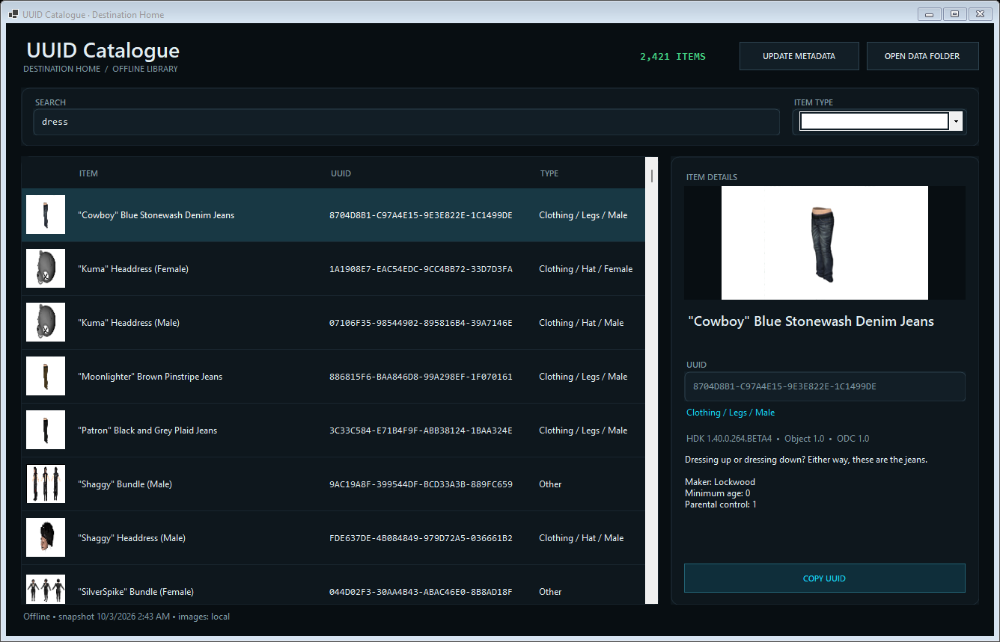
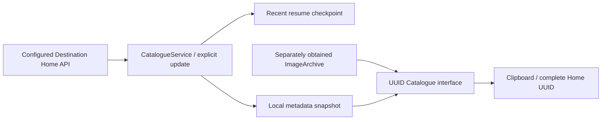

# UUID Catalogue

**Destination Home's offline item library for Windows.** Search PlayStation Home metadata, browse local previews and copy complete Home UUIDs from a standalone Windows Forms application.

**Status:** active / experimental · **Source checkpoint:** 2026-10-03 · **Platform:** Windows x64 · **Stack:** C# / .NET 8 Windows Forms



The October 3 screenshot shows the current interface with a filtered item count. The accompanying [existing offline QA record](docs/history/CATALOGUE_QA_OCT03.json) reports 66,704 entries, UUID search, type filtering, a local preview and three window sizes. Repository preparation rebuilt this source; it did not repeat that data-backed UI check or perform an online sync.

## Browse and inspect

- Search names, UUIDs, descriptions and categories; narrow the list by item type.
- View local thumbnails, larger previews, maker information, HDK/object/ODC versions and age metadata.
- Copy the complete `8-8-8-8` Home UUID from the details panel or double-click an item.
- Browse an existing snapshot offline. Explicit updates refresh metadata; the included script also fetches the configured public image archive.
- Resume recent interrupted downloads without replacing the previous completed snapshot until the new sync finishes.

This application runs independently of RPCS3. It does not attach to a game process or modify inventory.

## Build and run

Use Windows and a .NET SDK supporting `net8.0-windows`:

```powershell
dotnet build .\CatalogueViewer.csproj -c Release -p:Platform=x64
dotnet publish .\CatalogueViewer.csproj -c Release -p:Platform=x64 -r win-x64 --self-contained true -o .\bin\CatalogueViewer-Release
```

Run `bin\CatalogueViewer-Release\DestinationHome.Catalogue.exe`. Keep the published supporting files together. A self-contained publish includes the .NET runtime; a framework-dependent build needs the .NET 8 Desktop Runtime. [BUILDING.md](BUILDING.md) covers deployment, explicit online updates and the command-line modes.

Place your own snapshot and previews alongside the executable:

```text
Data/
  catalogue.json
  ImageArchive/
```

Without a snapshot, use **UPDATE METADATA** while online. That button downloads item details; pictures require a local image archive. **DATA FOLDER** opens the storage directory. Missing previews remain blank while metadata and UUID copying remain available.

## Architecture



| File | Purpose |
| --- | --- |
| `CatalogueViewerForm.cs`, `CatalogueTheme.cs` | Search/filter UI, local image handling, themed controls and offline layout verification |
| `CatalogueModels.cs` | Snapshot, item, version, legal and classification models |
| `CatalogueService.cs` | Paginated metadata sync, retry, resume and completed-snapshot replacement |
| `Program.cs` | Desktop entry point, sync-only and offline verification modes |
| `Update-OfflineCatalogue.ps1` | Self-contained publish, public image checkout and metadata refresh |
| `docs/` | [Storage/sync contracts](docs/ENGINEERING.md), [limitations](docs/KNOWN_ISSUES.md), [validation](docs/VALIDATION.md) and preserved UI evidence |
