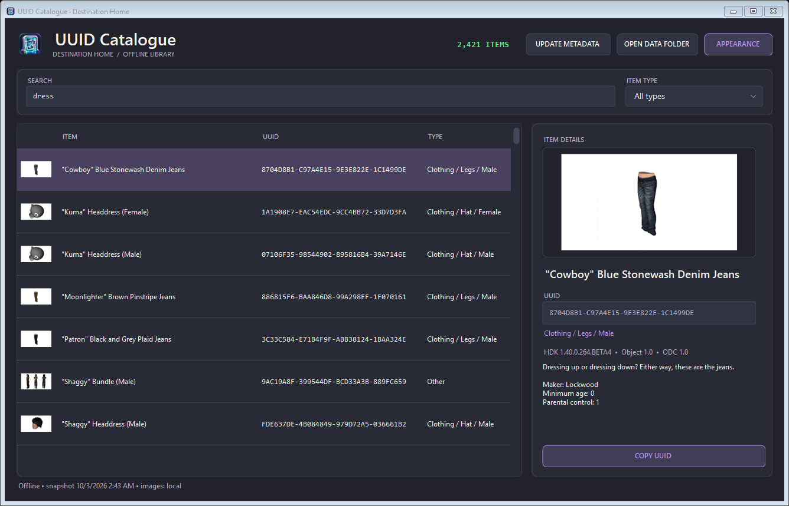
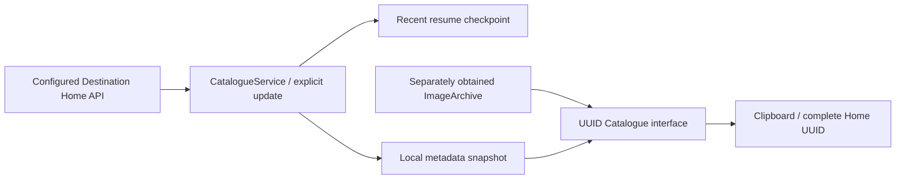

# UUID Catalogue

**Destination Home's offline item library for Windows.** Search PlayStation Home metadata, browse local previews and copy complete Home UUIDs from a standalone Windows Forms application.

**Status:** active / experimental · **Source checkpoint:** 2026-10-03 · **Platform:** Windows x64 · **Stack:** C# / .NET 8 Windows Forms

## Download and use

**[Download the latest Windows x64 app](https://github.com/Atom0420/Destination-Home-Catalogue/releases/latest/download/UUID-Catalogue-Windows-x64.zip)** · [Release notes and update package](https://github.com/Atom0420/Destination-Home-Catalogue/releases/latest)

Extract the entire ZIP and run `UUID-Catalogue/DestinationHome.Catalogue.exe`. No source build or runtime installation is needed. The portable package includes the existing 66,704-entry metadata snapshot for offline browsing. Previews use your own `Data/ImageArchive`; the full picture collection is not bundled. [Installation and updates](docs/INSTALLATION.md) cover first use, existing data, runtime-only updates and file hashes.



The current interface includes custom themed controls and an embedded gallery icon. The preserved October 3 [theme QA record](docs/history/CATALOGUE_THEMES_QA_OCT03.json) covers 66,704 metadata entries, all six themes, three window sizes, appearance preferences, dropdown behavior and simulated display scaling. [Appearance guide and gallery](docs/APPEARANCE.md) describe the controls and show every palette. A fresh [repository QA run](docs/VALIDATION.md) also passes those checks on the independently published binary. The displayed count is a filtered view.

## Browse and inspect

- Search names, UUIDs, descriptions and categories; narrow the list by item type.
- Choose Midnight, Dracula, Tokyo Night, Nord, Rosé Pine or Solarized through **APPEARANCE**. Switch animation and reactive interactions independently; preferences persist locally.
- View local thumbnails, larger previews, maker information, HDK/object/ODC versions and age metadata. Long details wrap and scroll independently while **COPY UUID** stays visible.
- Copy the complete `8-8-8-8` Home UUID from the details panel or double-click an item.
- Browse an existing snapshot offline. Explicit updates refresh metadata; the included script also fetches the configured public image archive.
- Resume recent interrupted downloads without replacing the previous completed snapshot until the new sync finishes.

This application runs independently of RPCS3. It does not attach to a game process or modify inventory.

## Build and run

Use Windows and a .NET SDK supporting `net8.0-windows`:

```powershell
dotnet build .\CatalogueViewer.csproj -c Release -p:Platform=x64
dotnet publish .\CatalogueViewer.csproj -c Release -p:Platform=x64 -r win-x64 --self-contained true -o .\bin\CatalogueViewer-Release
```

Run `bin\CatalogueViewer-Release\DestinationHome.Catalogue.exe`. Keep the published supporting files together. A self-contained publish includes the .NET runtime; a framework-dependent build needs the .NET 8 Desktop Runtime. [BUILDING.md](BUILDING.md) covers deployment, explicit online updates and the command-line modes.

Place your own snapshot and previews alongside the executable:

```text
Data/
  catalogue.json
  ImageArchive/
```

Without a snapshot, use **UPDATE METADATA** while online. That button downloads item details; pictures require a local image archive. **DATA FOLDER** opens the storage directory. Missing previews remain blank while metadata and UUID copying remain available.

## Architecture



| File | Purpose |
| --- | --- |
| `CatalogueViewerForm.cs`, `CatalogueTheme.cs` | Search/filter UI, local image handling, window chrome, layout and offline verification |
| `CatalogueAppearance.cs` | Six palettes, interaction switches and local preference persistence |
| `CatalogueInteractiveControls.cs`, `CatalogueContentControls.cs` | Custom buttons, dropdowns, toggles, scrollbars, details viewport and preview |
| `Assets/`, `Build-CatalogueIcon.ps1` | Original icon artwork, embedded multi-size Windows icon and format generator |
| `Package-Catalogue.ps1`, `CATALOGUE-UPDATE.txt` | Runtime-only update and optional full offline/source packaging |
| `CatalogueModels.cs` | Snapshot, item, version, legal and classification models |
| `CatalogueService.cs` | Paginated metadata sync, retry, resume and completed-snapshot replacement |
| `Program.cs` | Desktop entry point, sync-only and offline verification modes |
| `Update-OfflineCatalogue.ps1` | Self-contained publish, public image checkout and metadata refresh |
| `docs/` | [Storage/sync contracts](docs/ENGINEERING.md), [limitations](docs/KNOWN_ISSUES.md), [validation](docs/VALIDATION.md) and preserved UI evidence |

## Development status

Release build and self-contained publish pass with zero warnings or errors. Current external service availability and full downloads remain separate checks. No catalogue database, downloaded image collection, personal settings or release binaries are committed.

The offline verification mode now exercises appearance controls, all six palettes, dropdown keyboard/popup handling, long-detail reachability and simulated 125%/150%/200% layout/text scaling. Physical multi-monitor behavior and live metadata sync remain separate checks. Next work is to validate the service contract and add authored pagination/checkpoint fixtures. Source and third-party content rights are described in [LICENSE-NOTICE.md](LICENSE-NOTICE.md).
