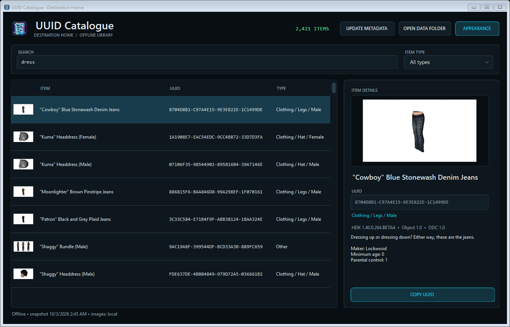
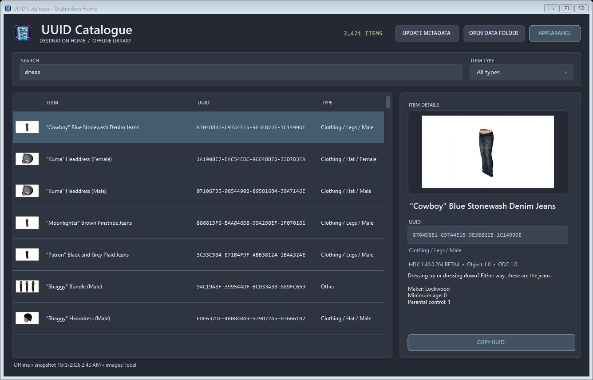
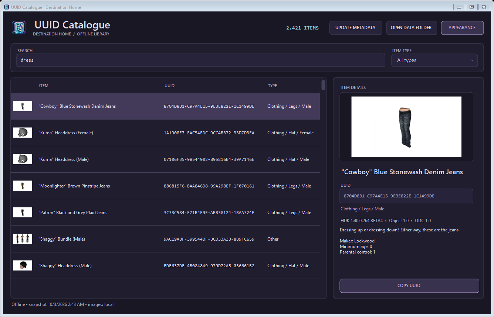
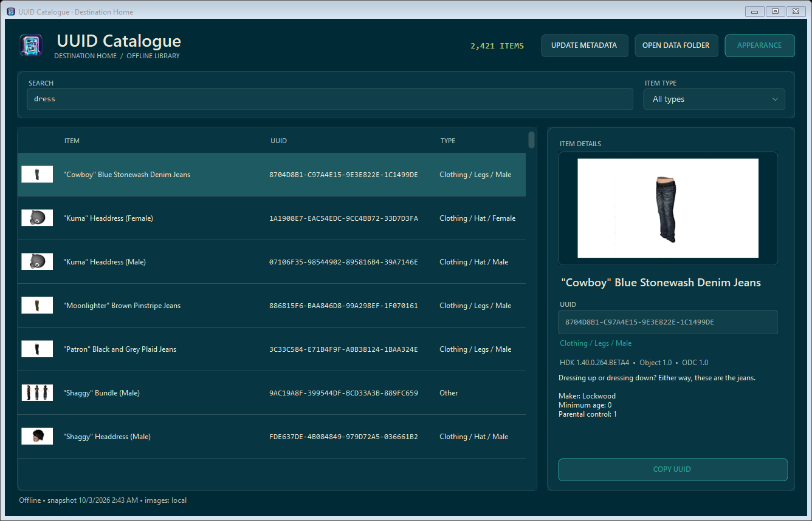
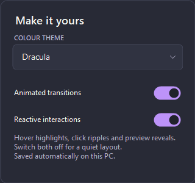
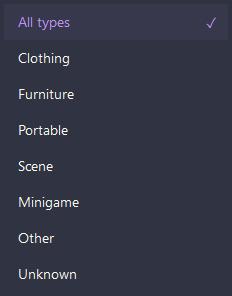

# Appearance and interface

Open **APPEARANCE** at the top right. Pick Midnight, Dracula, Tokyo Night, Nord, Rosé Pine or Solarized. The palette covers window chrome, backgrounds, list selection, buttons, dropdowns, scrollbars and previews.

| Setting | Behavior |
| --- | --- |
| Animated transitions | Enables brief interaction transitions when reactive interactions are also enabled |
| Reactive interactions | Enables hover/selection emphasis, button reactions and preview reveals |
| Both disabled | Provides a quiet layout without decorative motion |

Effects use interaction-driven timers rather than a continuous decorative loop. Preview hover keeps the whole item visible. Dropdowns are custom painted, with keyboard navigation and a themed popup; choosing a theme inside the appearance popup keeps that panel open.

Preferences live in `Data/viewer-settings.json` beside the executable and save automatically using a temporary file and replacement. Missing, malformed or unreadable settings fall back to Midnight with both switches enabled. The UI applies a selection even if saving fails and reports the failure in the status text. No metadata or image records are changed by an appearance selection.

Long titles, version text and descriptions wrap in an independently scrollable details panel. **COPY UUID** remains outside that scrolling content. The project uses PerMonitorV2 scaling and a minimum usable window size. The offline check simulates layout/text scaling; it does not establish acceptance on every physical monitor configuration.

## Theme gallery

These images are preserved from the matching October 3 local theme verification output. Counts reflect a filtered view. The original [QA record](history/CATALOGUE_THEMES_QA_OCT03.json) is retained separately from fresh repository validation.

### Midnight

### Dracula

### Tokyo Night

### Nord

### Rosé Pine

### Solarized

### Appearance controls and item-type popup

## Icon artwork

`Assets/catalogue-icon.png` is the original master artwork. `Assets/catalogue.ico` contains PNG-backed 16, 24, 32, 48, 64, 128 and 256 pixel frames. The project embeds the Windows icon and master artwork for the executable, window and header. Their logical resource names match the standalone `DestinationHome.Catalogue` namespace.

`Assets/ICON-NOTES.txt` preserves the supplied artwork provenance and prompt. `Build-CatalogueIcon.ps1` recreates the Windows format without changing the master. No external theme package or downloaded logo is required to build.
